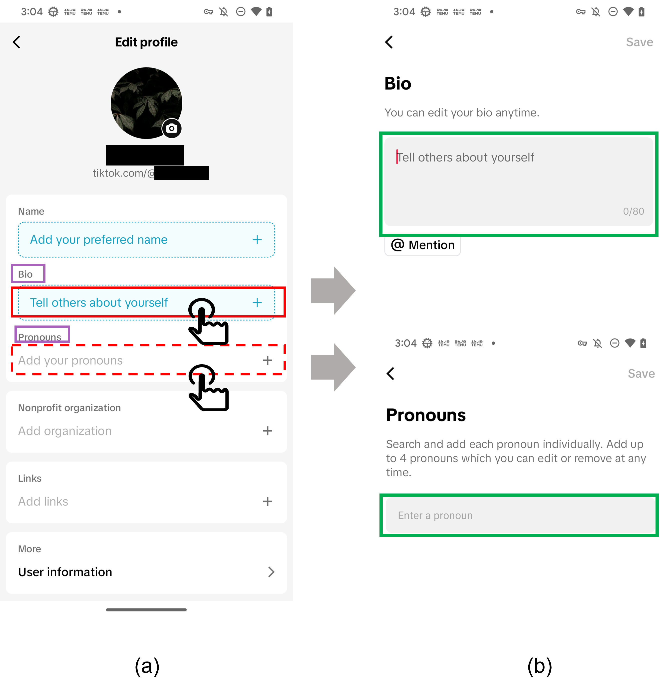
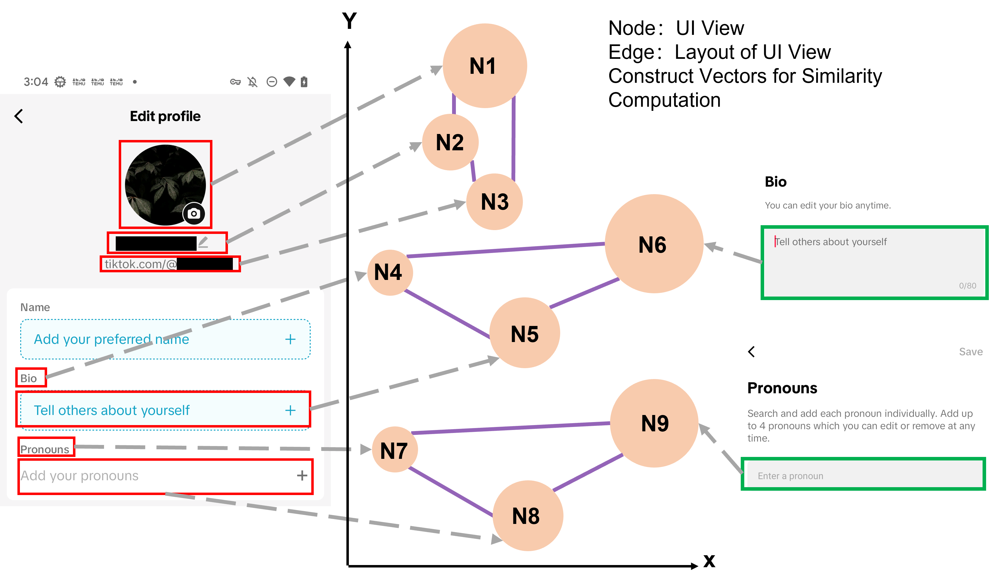

# FiCo

This repository is for FiCo, which breaks the limitation of keyword-dependent methods on personal data identification.

This repository consists of 2 parts,
1. In ./fico_code, we place our whole prototype code; one can check this directory for more details.
2. In ./corner_case_list, we place our released corner cases, keywords, and the source papers.


## fico_code
1. To run our code, you need to download the code first.
2. In `global_vars.py`, you need to change some places to adopt your own file:
   1) In line 9, you can choose an NLP model according to the language of your app.
   2) In line 18, we use the limited keyword list from the keyword-dependent approach as a starting point for affinity analysis.
3. Run the following command with pip:
```
pip install -r requirements.txt
```
4. FiCo takes UI hierarchy as input; you need to get UI hierarchies from existing tools. In our work, we use Fastbot2 https://github.com/bytedance/Fastbot_Android.
5. Then, run python3 app_explorer.py to start the analysis.

## motivation example
The unusual personal data (UDP) is as follows:


## methodology
Our main method is as follows:



## 📚 Citation

Please cite the following paper in your publications if FiCo helps your research.

```bibtex
@inproceedings{jiat2025fico,
  title     = {Identifying Unusual Personal Data in Mobile Apps for Better Privacy Compliance Check},
  author   = {Jiatao, Cheng, and Yuhong, Nan and Xueqiang, Wang and Zhefan, Chen and Yuliang, Zhang},
  booktitle = {2025 International Conference on Information and Communications Security (ICICS 2025)},
  year = {2025},
}
```


